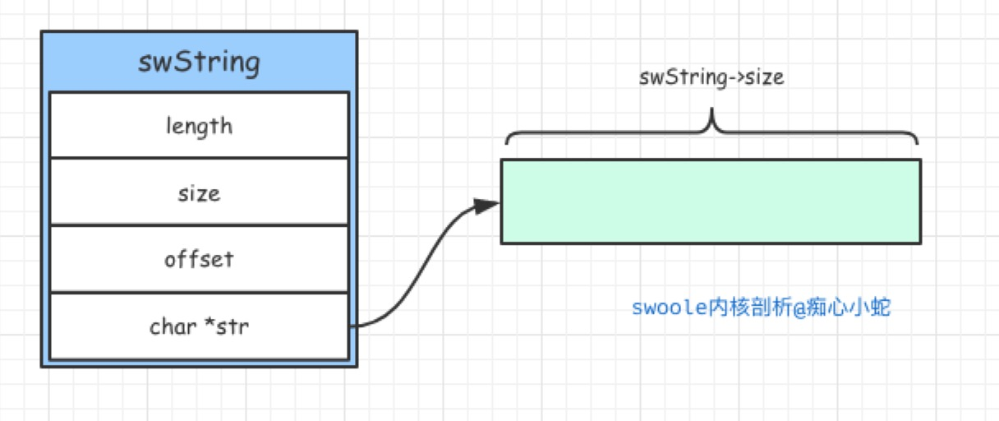
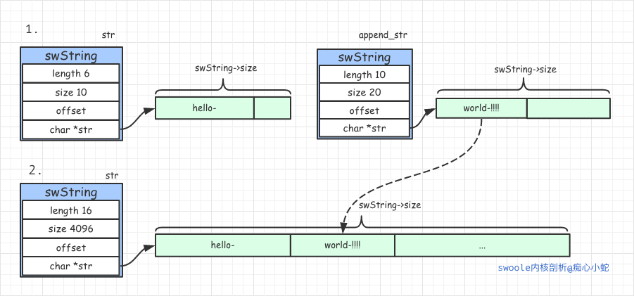

```
原创内容，转载请注明出处, 谢谢~
```

## 1.1 字符串

> swoole实现了自己的字符串`swString`，达到了空间的预分配和快速销毁，同时也是`swoole_buffer `的底层实现。


### 基本数据结构

```c
typedef struct _swString
{
    size_t length;   // 长度
    size_t size;     // 大小
    off_t offset;    // 偏移
    char *str;       // 字符串指针
} swString;
```

在结构体`swString`中，length是字符串的真实长度（不包含最后的'\0'字符），str是存储真实字符串的指针。

> 逻辑图



swoole通过一个`swString`结构体封装了字符串的各个属性。


### 基本函数

```c
// 新建字符
swString *swString_new(size_t size);
// 复制指定长度的字符串
swString *swString_dup(const char *src_str, int length);
// 复制字符串
swString *swString_dup2(swString *src);

// 打印字符串
void swString_print(swString *str);
// 销毁字符串
void swString_free(swString *str);
// 字符串追加
int swString_append(swString *str, swString *append_str);
int swString_append_ptr(swString *str, char *append_str, int length);
// 字符串写入
int swString_write(swString *str, off_t offset, swString *write_str);
int swString_write_ptr(swString *str, off_t offset, char *write_str, int length);
// 字符串空间扩展
int swString_extend(swString *str, size_t new_size);
// 字符串空间申请
char* swString_alloc(swString *str, size_t __size);
```

### 函数讲解

* `swString *swString_new(size_t size);`

新建字符串，就是单纯的在堆上申请一块`swString结构体`的内存，初始化并将每个字段初始化为0；然后将`swString->size`设置为函数参数的`size`;接着在堆上再申请一块size大小的内存块，返回的指针赋值给`swString->str`字段；之后返回`swString`的头地址。


* `int swString_extend(swString *str, size_t new_size);`

字符串扩展底层调用的就是`realloc`, 很简单,就是基本的库函数调用，而`new_size`的值却有很大的学问。是通过`swoole_size_align(new_length * 2, sysconf(_SC_PAGESIZE))`进行分配的，这样分配有啥好处呢？我们看看函数内部：

```c
static sw_inline size_t swoole_size_align(size_t size, int pagesize)
{
    // 字节内存对齐
    return size + (pagesize - (size % pagesize));
}
```
通过使用`size % pagesize`求的一个缺省的内存数**内存页大小，通常是4096**(4K) ，在加上size,这样保证了size永远是内存字节对齐的。至于为什么要进行内存对齐，网上搜索一下，大家就会明白。

* `int swString_append(swString *str, swString *append_str);`

追加字符串，就是将追加字符串拼接到字符串的后边。`swoole`首先判断两个字符串的总长度，是否大于源字符串的size属性，如果大于，就进行字符串扩展`swString_extend`, 然后将字符串`append_str->str`拼接到`str->str`后边。具体的过程如下图所示，



假如str的size空间是10，str->str是`hello-`6个字节，而追加字符串append_str->str是`world-!!!!`，长度是10，两者拼接是16，大于str的size,于是str进行了空间的扩展，扩展的结果是4096；然后将字符`world-!!!!`复制到`str->str + str->length`的地址。

* `int swString_write(swString *str, off_t offset, swString *write_str);`

字符串写入，和字符串的追加类似，就是写入的字符串`write_str`,拼接的时候，不是在`str->str + str->length`的位置，而是`str->str + offset`，这样就可以保证，在任何位置进行字符串的写入了。


### 核心知识点

> 如何实现空间的预分配

swoole通过自定义的swString结构体封装了c语言底层的字符串，swString结构体中的size字段标识每次从堆上申请的内存大小，这样每次申请的时候，就可以先申请一个大块内存，供字符串操作使用，而不用每次都去申请内存，要知道申请内存是非常昂贵的操作，提高了字符串操作的效率。

> 如何实现字符串的快速销毁

swoole的字符串是怎么实现快速销毁的呢？其实每次销毁字符串，都不用真的销毁内存，而是通过`offset`+`length`进行偏移，标识该字符串的删除，之后可能会用到新的字符串直接覆盖了。

> 细心的读者可能会发现，swString->offset这个字段，一直没有用到，其实该字段会在swoole工具箱`swoole_buffer`中有很重要的作用，那里就会用到了，我们在之后的章节再详细介绍吧。

---

[目录](../README.md)

[上一节 : 一次小小的swoole内核之旅]

[下一节 : 数组](./array.md)
