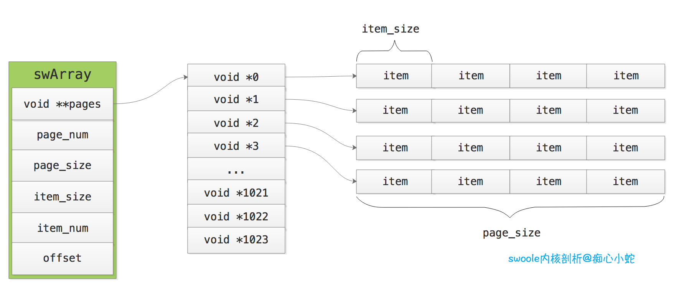

```
原创内容，转载请注明出处, 谢谢~
```

## 1.2 数组（动态数组）

### swArray数据结构

`swArray`是swoole的数组结构，实现了空间的动态扩容和快速清除。

### 基本数据结构

```c
typedef struct _swArray
{
    // void *指针数组，页空间
    void **pages;
    // 页的数量
    uint16_t page_num;
    // 页内可以容纳的元素个数
    uint16_t page_size;
    // 数据元素尺寸
    uint32_t item_size;
    // 已经有的元素个数
    uint32_t item_num;
    // 数组当前的索引位置偏移，用在追加元素中
    uint32_t offset; 
} swArray;
```

> 结构图



这是一个`swArray`的逻辑结构图，其`page->size`是4，`void *`指针是有几个才会用几个，开始创建的时候分配了1024个,但其实只使用了1个`void *`。

### 基本方法

```c
// 计算索引n位于swArray的哪个页(page)内
#define swArray_page(array, n)      ((n) / (array)->page_size)
// 计算索引n位与swArray指定页内的item的偏移量
#define swArray_offset(array, n)    ((n) % (array)->page_size)

// 新建数组
swArray *swArray_new(int page_size, size_t item_size);
// 销毁数组
void swArray_free(swArray *array);
// 获取数组元素
void *swArray_fetch(swArray *array, uint32_t n);
// 在指定的索引n处存入一个data数据
int swArray_store(swArray *array, uint32_t n, void *data);
// 分配n个元素，如果页不够用，就扩充数组
void *swArray_alloc(swArray *array, uint32_t n);
// 追加一个元素
int swArray_append(swArray *array, void *data);
// 扩展数组，分配一个page页结构
int swArray_extend(swArray *array);
// 清除数组内容
void swArray_clear(swArray *array);
```

### 核心技术点分析

1. 新建一个数组`swArray_new`,需要定义好每个page中元素的个数和元素的大小；之后使用`swArray_extend`预分配一个page。

```c
swArray *swArray_new(int page_size, size_t item_size)
{
    // 申请一块swArray结构体内存
    swArray *array = sw_malloc(sizeof(swArray));
    if (array == NULL)
    {
        swoole_error_log(SW_LOG_ERROR, SW_ERROR_MALLOC_FAIL, "malloc[0] failed.");
        return NULL;
    }
    bzero(array, sizeof(swArray));

    // 初始化pages为1024个void *指针
    array->pages = sw_malloc(sizeof(void*) * SW_ARRAY_PAGE_MAX);
    if (array->pages == NULL)
    {
        sw_free(array);
        swoole_error_log(SW_LOG_ERROR, SW_ERROR_MALLOC_FAIL, "malloc[1] failed.");
        return NULL;
    }

    // 设置属性
    array->item_size = item_size;
    array->page_size = page_size;

    // 数组扩展
    swArray_extend(array);
    return array;
}

int swArray_extend(swArray *array)
{
    // 页的数量达到1024， 警告
    if (array->page_num == SW_ARRAY_PAGE_MAX)
    {
        swWarn("max page_num is %d", array->page_num);
        return SW_ERR;
    }
    array->pages[array->page_num] = sw_calloc(array->page_size, array->item_size);
    if (array->pages[array->page_num] == NULL)
    {
        swWarn("malloc[1] failed.");
        return SW_ERR;
    }
    // 已经分配的元素个数加1， new之后先分配一个
    array->page_num++;
    return SW_OK;
}
```
2. 接着就可以给数组中追加元素了，追加元素`swArray_append`是基于swArray中的`offset`属性的，该属性就是当前元素的偏移量，也就是当前元素的索引，是一个累加值。
3. 而`swArray_store`则是在用户指定的索引n上，添加元素

```c
int swArray_store(swArray *array, uint32_t n, void *data)
{
    // 使用swArray_page找到哪个page
    int page = swArray_page(array, n);
    if (page >= array->page_num)
    {
        swWarn("fetch index[%d] out of array", n);
        return SW_ERR;
    }

    // swArray_offset找到page内部的偏移
    memcpy(array->pages[page] + (swArray_offset(array, n) * array->item_size), data, array->item_size);
    return SW_OK;
}
```
4. 清除数组

```c
void swArray_clear(swArray *array)
{
    array->offset = 0;
    array->item_num = 0;
}
```
所谓数组的快速清除，就是直接标识array的`offset`,`item_num`字段为0，再添加数据直接对原有数据进行覆盖。


### 总结

`swoole`为什么要自定义一种数组结构，其实就是为了获得数组的**动态扩充内存大小**特性。我们知道c语言的数组是没有动态扩充大小的特性的，数组一旦定义就已经确定了数组的大小，这样很不方便。


