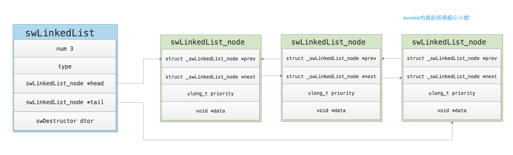

```
原创内容，转载请注明出处, 谢谢~
```

## 1.3 链表

> 链表是一种基本的数据结构，之所以使用链表，是因为数组的插入删除时间复杂度是O(n),而使用链表的时间复杂度是O(1)。那么swoole中是如何实现的呢？

> 在swoole中对链表的操作有两种实现，一种是swoole自己定义了链表的相关结构体，实现了链表的基本操作函数。另一种是使用了`UTLIST`宏。

### 基本结构

```c
// 链表结点
typedef struct _swLinkedList_node
{
    struct _swLinkedList_node *prev; // 上一个
    struct _swLinkedList_node *next; // 下一个
    ulong_t priority;  // 优先级
    void *data; // 数据
} swLinkedList_node;

// 链表
typedef struct
{
    uint32_t num; // 元素个数
    uint8_t type; // 类型
    swLinkedList_node *head; // 指向头结点
    swLinkedList_node *tail; // 指向尾结点
    swDestructor dtor;       // 析构回调函数
} swLinkedList;
```

> 结构图



swoole的链表结构首先使用`swLinkeList`来标识一个链表，其中`head`,`tail`分别指向链表的头和尾,`num`字段标识链表结点的个数。


### 相关函数

```c
// 新建链表
swLinkedList* swLinkedList_new(uint8_t type, swDestructor dtor);
// 添加结点都链尾
int swLinkedList_append(swLinkedList *ll, void *data);
// 删除结点
void swLinkedList_remove_node(swLinkedList *ll, swLinkedList_node *remove_node);
// 添加结点到链头
int swLinkedList_prepend(swLinkedList *ll, void *data);
// 弹出链尾元素
void* swLinkedList_pop(swLinkedList *ll);
// 弹出链头元素
void* swLinkedList_shift(swLinkedList *ll);
// 释放链表
void swLinkedList_free(swLinkedList *ll);
```

### 核心知识点

其实链表的操作还是很简单的，也是数据结构这门课程中的基本数据结构。在`swoole`中，使用了一个总的链表标识结构体，可以很便捷的获取链表的头尾结点，进而便于在头尾插入结点和在头尾初，弹出结点。


### `UTLIST`链表宏操作

`UTLIST`是链表数据结构的宏定义实现，它是开源的。其头文件已经做了详细的描述。

```c
/*
 * This file contains macros to manipulate singly and doubly-linked lists.
 * 
 * 1. LL_ macros:  singly-linked lists.  单向链表
 * 2. DL_ macros:  doubly-linked lists.  双向链表
 * 3. CDL_ macros: circular doubly-linked lists. 双向循环链表
 *
 * To use singly-linked lists, your structure must have a "next" pointer.
 * To use doubly-linked lists, your structure must "prev" and "next" pointers.
 * Either way, the pointer to the head of the list must be initialized to NULL.
 * 头结点必须初始化为空
 *
 * ----------------.EXAMPLE -------------------------
 * struct item {
 *      int id;
 *      struct item *prev, *next;
 * }
 *
 * struct item *list = NULL:
 *
 * int main() {
 *      struct item *item;
 *      ... allocate and populate item ...
 *      DL_APPEND(list, item);
 * }
 * --------------------------------------------------
 *
 * For doubly-linked lists, the append and delete macros are O(1)
 * For singly-linked lists, append and delete are O(n) but prepend is O(1)
 * The sort macro is O(n log(n)) for all types of single/double/circular lists.
 */
```

`UTLIST`实现了单向链表，双向链表，双向循环链表。其中`LL_ macros`表示单向链表，`DL_ macros`表示双向链表，`CDL_ macros`表示双向循环链表。在使用单向链表时，你的结构体必须要有一个`next`指针，在使用双向链表时，你必须要有`next`,`pre`两个指针,不管怎样，指向链表头结点的指针必须初始化为`NULL`。