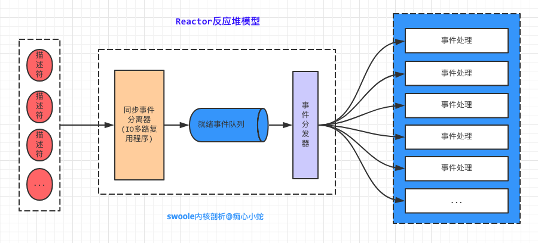

```
原创内容，转载请注明出处, 谢谢~
```

## 3.2 反应堆模型

在反应堆模型中，有4个重要的参与者。

1. 描述符
2. 同步事件分离器(*IO多路复用程序*)
3. 事件分发器
4. 事件处理器

事件本质是对描述符的**操作**的一种抽象，每当`描述符`(套接字)准备好连接应答(*accept*),可写，可读，关闭时，就会产生一个相关的文件事件，而`同步事件分离器`(*IO多路复用程序*)就是对这些事件进行监听的。
程序开始的时候，我们首先需要将不同的事件对应的事件处理器注册到反应堆模型上，当反应堆模型产生特定的事件时，`事件分发器`就会将该事件告知对应的`事件处理器`，该事件处理器开始执行。这里事件分发器是线性处理的，
因为在同步事件分离器，会将准备就绪的事件放入一个操作系统内核的队列中，我们需要一个一个处理。



在`swoole`中，反应堆模型也是基于这个模型的。并且`swoole`根据不同的操作系统，调用了不同的系统调用。
在源码目录`src/reactor`中，是`swoole`反应堆的实现。

~~~
src/reactor
    |
    |-- base.c     // 基本程序 
    |-- epoll.c    // linux特有
    |-- kqueue.c   // mac系统
    |-- poll.c     // linux/unix
    |-- select.c   // linux/unix 
~~~

linux下最常用的就是epoll,因为其更加高效，突破了`C10k`的限制。所以本篇问文章，也主要将`epoll`在`swoole`中的使用。

### 反应堆的创建过程

要使用反应堆，首先要创建反应堆，`swoole`创建反应堆的函数是`swReactor_create`。
~~~c
int swReactor_create(swReactor *reactor, int max_event)
{
    int ret;
    bzero(reactor, sizeof(swReactor));

#ifdef HAVE_EPOLL
    ret = swReactorEpoll_create(reactor, max_event);
#elif defined(HAVE_KQUEUE)
    ret = swReactorKqueue_create(reactor, max_event);
#elif defined(HAVE_POLL)
    ret = swReactorPoll_create(reactor, max_event);
#else
    ret = swReactorSelect_create(reactor);
#endif

    reactor->running   = 1;                    // 表明反应堆正在运行 [事件循环一直进行]
    reactor->setHandle = swReactor_setHandle;  // 设置句柄处理函数
    reactor->onFinish  = swReactor_onFinish;   // 结束回调
    reactor->onTimeout = swReactor_onTimeout;  // 超时会掉

    reactor->write     = swReactor_write;      // 写
    reactor->defer     = swReactor_defer;      // 延迟
    reactor->close     = swReactor_close;      // 关闭
   
    /*
        新建了反应堆的数组
        每个page是1024个swConnection大小
     */
    reactor->socket_array = swArray_new(1024, sizeof(swConnection));
    
    if (!reactor->socket_array)
    {
        swWarn("create socket array failed.");
        return SW_ERR;
    }

    return ret;
}

int swReactorEpoll_create(swReactor *reactor, int max_event_num)
{
    //create reactor object
    swReactorEpoll *reactor_object = sw_malloc(sizeof(swReactorEpoll));
    if (reactor_object == NULL)
    {
        swWarn("malloc[0] failed.");
        return SW_ERR;
    }
    bzero(reactor_object, sizeof(swReactorEpoll));
    reactor->object = reactor_object;
    reactor->max_event_num = max_event_num;

    reactor_object->events = sw_calloc(max_event_num, sizeof(struct epoll_event));

    if (reactor_object->events == NULL)
    {
        swWarn("malloc[1] failed.");
        sw_free(reactor_object);
        return SW_ERR;
    }
    // epoll create
    /*
        告诉内核这个监听的数目一共有多大
     */
    reactor_object->epfd = epoll_create(512);
    if (reactor_object->epfd < 0)
    {
        swWarn("epoll_create failed. Error: %s[%d]", strerror(errno), errno);
        sw_free(reactor_object);
        return SW_ERR;
    }
    // binding method
    reactor->add  = swReactorEpoll_add;
    reactor->set  = swReactorEpoll_set;
    reactor->del  = swReactorEpoll_del;
    reactor->wait = swReactorEpoll_wait;
    reactor->free = swReactorEpoll_free;

    return SW_OK;
}
~~~

首先更具不同的系统申请，调用不同的IO多路复用程序,在`swReactorEpoll_create`中，创建反应堆对象。然后设置各种回调函数
其中`reactor->setHandle`,就是`事件分发器`，负责将`事件管理器`注册到`reactor模型`上，并在事件发生时，调用具体的`事件处理器`。

另外，`swoole的reactor模型`最核心的就是将`描述符`添加到`reactor模型上`的`swReactorEpoll_add`,和开启事件循环的`swReactorEpoll_wait`函数。

* `int swReactorEpoll_add(swReactor *reactor, int fd, int fdtype)`


* `int swReactorEpoll_wait(swReactor *reactor, struct timeval *timeo)`
