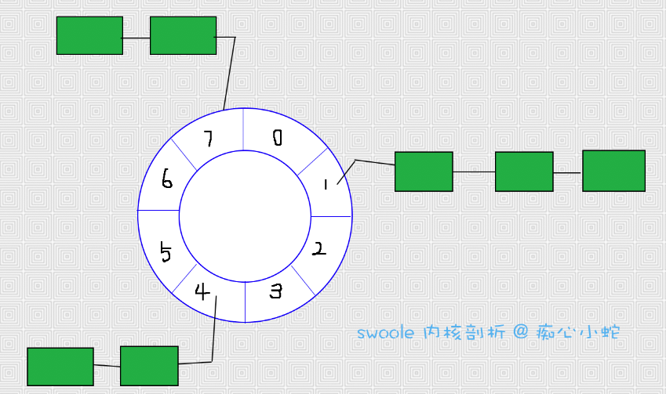

```
原创内容，转载请注明出处, 谢谢~
```

## 8.5 时间轮算法

> `swoole`使用时间轮算法对超时的客户端连接进行踢除。如果`swoole`没有开启时间轮调度算法，默认启用`心跳检测算法`。

在一个网络服务器中，需要管理大量客户端连接，其中每个客户端都要管理它的超时(timeout)时间。当客户端的连接超时之后，
我们就要想办法将其踢除。最原始的方法就是对每一个客户端连接都设置一个`timer`定时器，但客户端连接可以达到百万级别时，
会严重影响服务器的性能，并不现实，这时候就有必要使用`时间轮算法`来优化这一个问题了。

定时轮是一种环形数据结构，其主体是一个循环列表（circular buffer），每个列表中包含一个称之为槽（slot）的结构。至于 slot 的具体结构依赖具体应用场景，可以是链表，也可以是哈希表。

> 逻辑图



这是常规的时间轮算法逻辑图，而`swoole`只是将其中的链表改为了哈希表。


~~~c
typedef struct
{
    uint16_t current;
    uint16_t size;
    swHashMap **wheel;

} swTimeWheel;
~~~

`swoole时间轮结构体`中，current表示当前时间轮指针所在的位置，size表示时间轮有几个槽，wheel表示每个槽具体的数据结构，`swoole`在这里用了哈希表实现。


